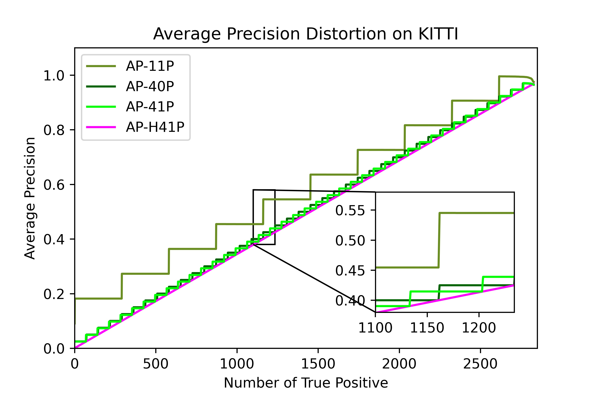

# Enhanced N-Point Interpolation Method for Average Precision Calculation

<div align="left">
  
  
</div>

STI Team, LITIS LAB, INSA ROUEN. 10/04/2021

[paper](https://www.sciencedirect.com/science/article/abs/pii/S016786552200126X)

Zhang, Haodi, Alexandrina Rogozan, and Abdelaziz Bensrhair. "An enhanced N-point interpolation method to eliminate average precision distortion." Pattern Recognition Letters 158 (2022): 111-116.
---

## 1. Purpose

- **To Eliminate Average Precision Distortion**

The evaluation metric '**Average Precision**' with the [40-point interpolation method](https://research.mapillary.com/img/publications/MonoDIS.pdf) for KITTI 3D Object Detection benchmark has the problem we called ***average precision distortion***.

<div align="left">
  
</div>

The ***average precision distortion*** refers to the large error between the interpolated interval area and the area under the curve (AUC) when calculating the area under the PR curve. As shown in the figure, the N-point interpolation method steps up and does not correctly reflect the model performance.

<br/> 

- **To Avoid The Mix Usage of 11/40-point Interpolation**

When using *kitti_utils*, please make sure that *eval.py* does not confuse the usage of 11/40 point interpolation. We have found this problem with a lot of code that uses this evaluation module. This issue will lower your model AP score!

> For example: In [MMdetection3D](https://github.com/open-mmlab/mmdetection3d/blob/master/mmdet3d/core/evaluation/kitti_utils/eval.py). Line512 sets the number of sample points is 41. Then go to Line8, we get 41 thresholds. But when Line575 calculates the mAP, it changes to 11.

## 2. Usage

### 2.1 Get the code
You do not have to install this code, as long as your python3 enviroment has been correctly configured. We recommend using the python virtual environment.

### 2.2 Use virtual environment:
```shell
cd ~

# We use python3.6, you can change the version of python
# 1.Set python virtual environment
virtualenv .aph --python=python3.6

# 2. Start python virtual environment
source .aph/bin/activate
```

### 2.3 Install requirements
```shell
# The most important package is numba==0.48
pip install -r requirements.txt
```

### 2.4 Prepare KITTI

In *demo.py*, there are three data-related variables that need to be set.

```python
# 1. Your detection results
RESULT_FILES_PATH=sys.argv[1] 
# 2. Ground truth labels
GT_ANNOS_PATH = './data/kitti_3d/training/label_2/'
# 3. Data splits
DATA_SPLIT_FILE = './data/kitti_3d/split/val.txt'
```

We also provide [sample results](https://drive.google.com/drive/folders/1VHfQoepyTE4sVk41ExTz6L8pwINrPjK-?usp=sharing) for testing.

The sample results includes: 

**Detection results**: parta2_lidar.zip, second_lidar.zip, pointpillars_lidar.zip.

**Ground truth**: training.zip, split.zip.


### 2.5 Run the demo.py

***Attention!!!***: This code need gpu and cuda. The cuda version could be cuda9.0, cuda10.0, cuda10.1. Other version of cuda is not tested but should also work correctly.

```shell
python demo.py data/results/pointpillars_lidar/
# or
python demo_cmp.py data/results/pointpillars_lidar/
```

You can also change the method for calculating average precision. The available method list is as below.

- apMethod.interpAll 
- apMethod.interp11
- apMethod.interp40
- apMethod.interp41
- apMethod.interpHyb11
- apMethod.interpHyb40
- apMethod.interpHyb41

